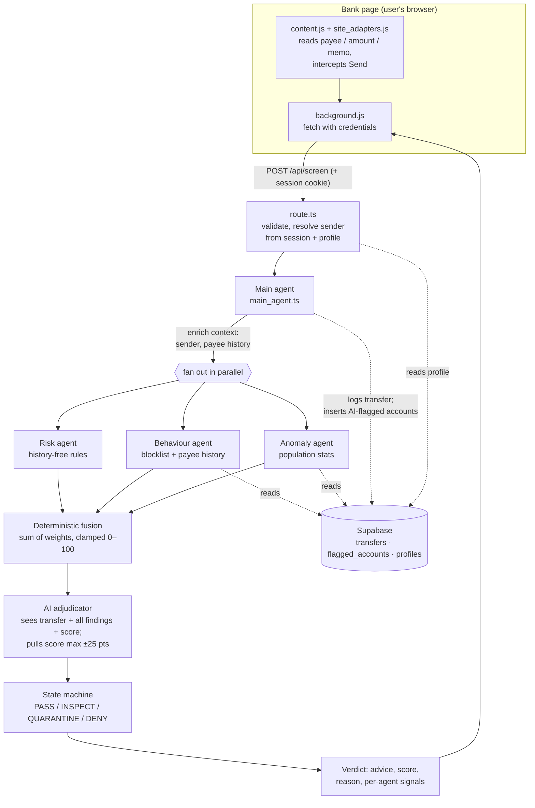

# Sentinel Scam Shield — Architecture

Sentinel is a browser extension plus a multi-agent screening API. The extension
intercepts a transfer on a bank's own page before the user presses Send; the
API screens it through three deterministic specialist agents and an AI
adjudicator, fuses every signal into one explainable verdict, and the extension
renders that verdict as a warning card. Sentinel warns — it never freezes an
account and never touches the money.

## System diagram

## The pipeline, stage by stage

### 0. Interception (`extension/`)

MV3 extension. `content.js` reads the transfer fields from the bank page via
per-bank selectors isolated in `site_adapters.js`, and intercepts the Send
click. `background.js` owns the network call (extension host permissions
sidestep page CORS) and sends the session cookie so a signed-in user's profile
can enrich the screen. Fail-open by design: if the API is unreachable the
transfer proceeds with a "screening unavailable" note — a down service must
never become a denial of service on someone's own money.

### 1. Intake and sender resolution (`src/app/api/screen/route.ts`)

Validates `{ payee, amount, memo? }` with zod. If the request carries a
Sentinel session cookie, the route resolves the sender's stored profile
(`profiles` table) into `{ sender_name, sender_age }`. Anonymous requests are
screened identically — every enrichment field in the system is optional.

### 2. Context enrichment (`src/lib/agents/main_agent.ts`)

Before fan-out, the main agent fetches the recipient's history once and builds
the complete `TransferContext` every agent and the AI see:

| Field | Source |
|---|---|
| `payee`, `amount`, `memo` | the bank page |
| `observed_at`, `channel`, `currency` | stamped at intake |
| `sender_name`, `sender_age` | session + `profiles` (when signed in) |
| `prior_flag_count` | `get_behaviour_stats` RPC |
| `payee_transfer_count`, `payee_avg_amount` | `get_behaviour_stats` RPC |

Nothing is pre-filtered: the AI adjudicator receives this whole object, every
specialist finding, and the deterministic score.

### 3. Specialist fan-out (parallel)

**Risk agent** (`risk_agent.ts` → `cold_rules.ts`) — history-free; valid even
on a cold database.

**Behaviour agent** (`behaviour_agent.ts`) — recipient-scoped. Checks the
shared scam-account blocklist and the recipient's prior-transfer history, in
parallel.

**Anomaly agent** (`anomaly_agent.ts`) — population-scoped. Compares the
amount against all recorded transfers and watches short-window velocity.

### 4. The full signal surface

Only **one** of the ten deterministic signals reads text. Coach a victim to
type "rent" in the reference or leave it blank — everything else still fires.

| Signal | Agent | Weight | Reads |
|---|---|---:|---|
| `KNOWN_FLAGGED_ACCOUNT` | behaviour | 80 | shared blocklist |
| `SCAM_KEYWORD` | risk | 30 | memo/payee text (the only text signal) |
| `REPEAT_FLAGGED_PAYEE` | behaviour | 25 | recipient's flag history |
| `HIGH_ABSOLUTE_AMOUNT` | risk | 22 | amount |
| `PAYEE_AMOUNT_SPIKE` | behaviour | 20 | amount vs recipient average |
| `NEW_PAYEE` | behaviour | 18 | recipient history |
| `POPULATION_OUTLIER` | anomaly | 16 | amount z-score vs population |
| `HIGH_VELOCITY` | anomaly | 14 | transfers per 10-minute window |
| `ROUND_CASHOUT` | risk | 12 | round-number amount pattern |
| `ODD_HOUR_TRANSFER` | risk | 10 / 20 | clock time (00:00–05:59); weight raised for senders 60+ |

Age-aware weighting is internal only: the user-facing explanation always
describes the transfer's behaviour, never the sender's age.

### 5. Deterministic fusion (`src/lib/risk/fusion.ts`)

Signal weights are summed and clamped to [0, 100]. Reproducible: the same
transfer and history always produce the same deterministic score, independent
of the AI.

### 6. AI adjudication (`src/lib/screen/ai_screener.ts`)

An LLM (OpenAI-compatible; DeepSeek in the current deployment) rules **last**,
on the complete evidence — raw transfer, all specialist findings, and the fused
score. Three hard controls bound its power:

1. **Bounded swing.** The AI pulls the score 60% of the way toward its own
   estimate, capped at ±25 points (`apply_ai_adjudication`). It can tip
   borderline cases; it can never clear strong deterministic evidence or
   manufacture a block from nothing. Corollary (tested): a blocklist hit
   (weight 80) minus the maximum pull (−25) is still 55 — the warning band. A
   known scam account can never be washed to "allow".
2. **Reason guard.** The AI's explanation is shown only when its advice agrees
   with the final fused advice (`choose_user_reason`), so the card can never
   carry a warning frame with an "appears low risk" body.
3. **Fail-safe.** Missing key, timeout, or malformed response → the
   deterministic verdict stands alone.

The AI also has one write capability: `flag_account`. When it both blocks the
transfer **and** explicitly concludes the recipient account itself is a scam or
mule destination, the main agent adds the account to the shared blocklist
(source `ai`). The double condition means a mild verdict can never blocklist
anyone, and inserts ignore duplicates so a manual entry is never overwritten.

### 7. State machine and verdict (`src/lib/risk/state_machine.ts`)

The final score maps to a graduated firewall state: PASS (<30) → INSPECT
(30–54) → QUARANTINE (55–79) → DENY (80+), rendered to the user as
allow / warn / warn / block. The verdict carries the advice, score, one-line
reason, and the per-agent signal breakdown — full explainability, no black box.

### 8. Persistence (`docs/supabase_schema.sql`, service-role only, RLS locked)

| Table | Written by | Read by |
|---|---|---|
| `transfers` | main agent (every screen) | behaviour + anomaly RPCs |
| `flagged_accounts` | team seeds (manual) + AI (`flag_account`) | behaviour agent, every screen |
| `profiles` | signup route | screen route (sender enrichment) |

Because every bank adapter writes to the same `transfers` table keyed by
normalized `payee_key`, a recipient flagged on one bank's site is already
visible when the same recipient appears on another bank's site — the blocklist
makes that memory explicit and shareable.

## Evidence, not claims

- **Coached-scammer scenario** (`src/lib/screen/coached_scammer.test.ts`):
  blank memo, neutral payee, RM9,000 — no text signal fires, yet the engine
  reaches QUARANTINE from amount/history/population alone, and DENY for an
  elderly sender coached at 2 a.m.
- **Blocklist is un-washable** (`src/lib/agents/behaviour_agent.test.ts`): a
  blocklist hit alone reaches DENY, and survives the AI's maximum downward pull
  above the warning band.
- 40+ unit tests across rules, fusion, state machine, and all three agents;
  every DB and AI dependency fails safe so the engine degrades gracefully
  instead of breaking.

## Honest limitations

- **Recipient-keyed linkage.** Cross-bank memory keys on the recipient
  account. A ring using a different mule account per bank is not linked yet;
  the roadmap answer is payee-name fuzzy matching and operating the blocklist
  as a shared consortium feed.
- **Server-local clock.** `ODD_HOUR_TRANSFER` uses the server's local hour —
  correct while the server runs in the user's timezone; production would carry
  the client timezone.
- **Consumer-side vantage.** The extension sees only what the bank page shows.
  The same engine embedded at a bank's transfer-confirmation step (the B2B
  path) would see full account history and device signals.
